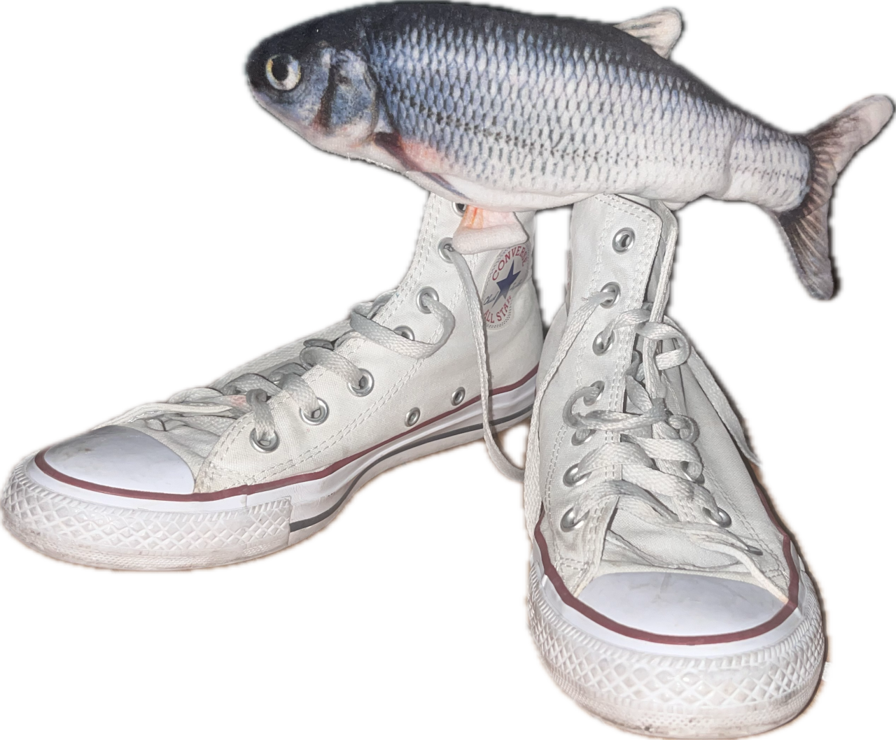

<p align="center">
  
</p>

<p align="center">
  <sub>Fih</sub>
</p>

<h1 align="center">GymFishes 🐟</h1>

<p align="center">
  Competição de beber água entre duas pessoas — registre, compare e vença o mês.
</p>

## 💧 O que é

Você e sua parceira registram a água que bebem durante o dia (garrafas, copos ou uma
quantidade exata). O app mostra em tempo real quem está na frente hoje, na semana, no mês
e desde o início — com peixinhos que sobem conforme a água enche. 🐠

- 📱 Feito para celular — instala direto na tela de início do iPhone
- 🇧🇷 Todo em português
- 🏆 Ranking diário, semanal, mensal e total
- 🐡 Treze peixes desenhados para escolher o seu
- 🎨 Seis temas escuros para escolher no Perfil
- ✈️ Funciona até sem internet — sincroniza quando a conexão voltar

## 🚀 Como rodar no computador

Você só precisa do [Node.js](https://nodejs.org) (versão 20 ou mais nova).

```bash
npm install                 # baixa as dependências
cp .env.example .env.local  # preencha com a URL e a chave do projeto no Supabase
npm run dev                 # abre o app em http://localhost:5173
```

As duas chaves ficam no painel do projeto em [supabase.com](https://supabase.com)
(Settings → API): a "Project URL" e a chave "anon public".

Para rodar o teste ponta a ponta (abre o app num iPhone simulado e registra 500 ml):
`npm run e2e`, com `E2E_EMAIL` e `E2E_PASSWORD` preenchidos no `.env.local`.

## 🗂️ Como o projeto é organizado

```
src/
  screens/    as telas do app (Hoje, Ranking, Histórico, Perfil…)
  features/   cada funcionalidade (registros, garrafas, grupo, peixes…)
  lib/        lógica pura: datas, períodos, formatação
  ui/         botões e componentes visuais básicos
  styles/     cores dos seis temas e estilos globais
supabase/     banco de dados (mudanças no banco)
docs/         especificação e planos do projeto
```

## 🧰 Comandos úteis

| Comando | O que faz |
|---|---|
| `npm run dev` | abre o app para desenvolver |
| `npm run test:run` | roda os testes |
| `npm run build` | gera a versão final |
| `npm run fish:sheet` | desenha os 13 peixes numa imagem para conferir |

Detalhes técnicos (banco de dados, decisões de design) estão na
[especificação](docs/superpowers/specs/2026-08-11-gymfishes-design.md).